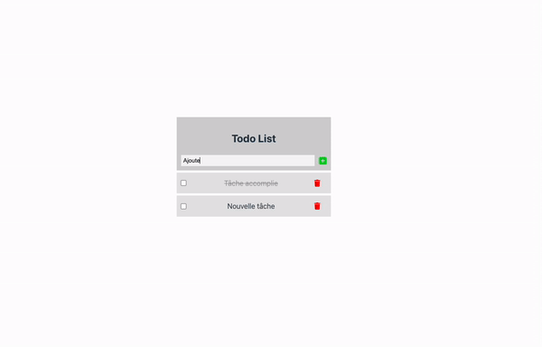

# Laravue TodoList

## Simplest Todo list app

This features a simple CRUD on the api-side, built with Laravel,
and a set of reactive components on the client-side, built with Vue 3.
The DB is MySql.

## How to make it run locally:

`php artisan serve` + `npm run dev`

Do not forget to create the .env at the root of the folder.
It also needs a .env at the root of the vue folder to provide the base url of the server.

It could be necessary to also run `npm install` from inside the vue folder.
